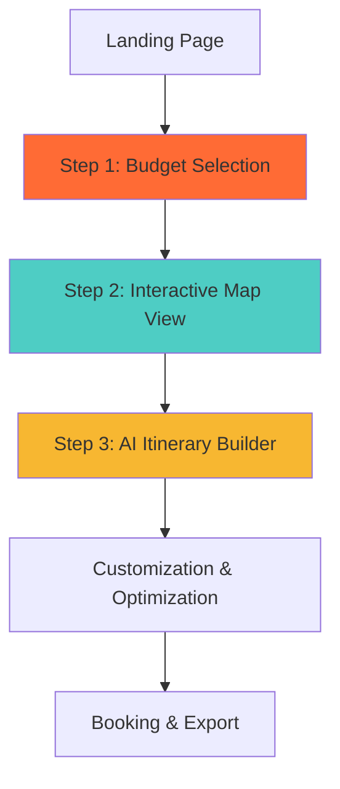
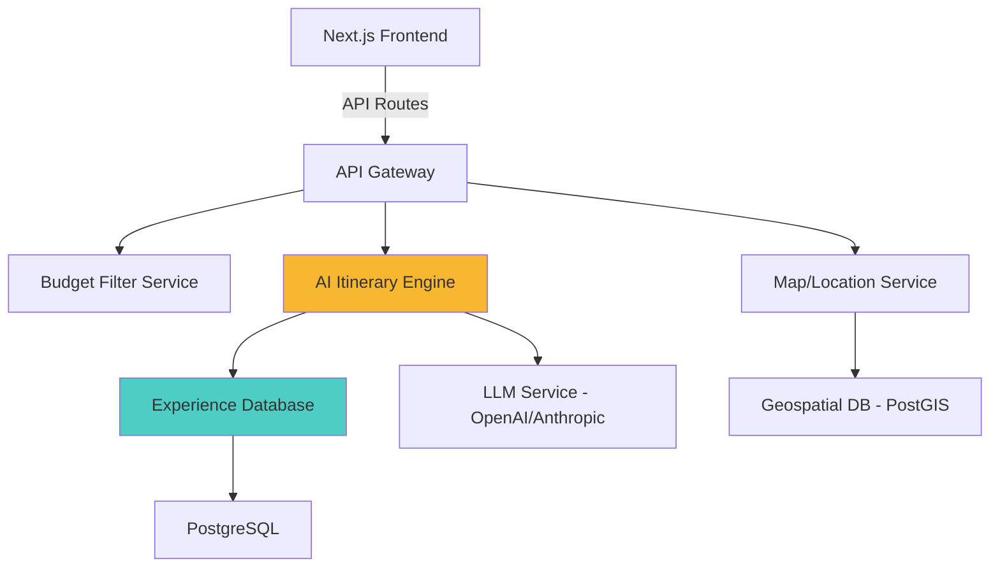

# Velosta Redesign: Product Requirements Document

## Implementation Status — February 2026

> ✅ **Core MVP is fully implemented and production-ready.** All three phases of the user flow are functional with real data, AI integration, and export capabilities.

| PRD Requirement | Status | Implementation |
|----------------|--------|----------------|
| Cinematic cloud-to-city intro | ✅ Complete | `BudgetFilter.tsx` — multi-layer cloud dissolve over live 3D Mapbox city |
| Geolocation-based city background | ✅ Complete | Detects user city, fallback to Hyderabad |
| Budget slider interface | ✅ Complete | ₹3,000–₹2,00,000 range slider with dynamic tier labels (4 tiers) |
| Trip type selection | ✅ Complete | Solo / Couple / Family / Friends (Lucide icons) |
| Duration selection | ✅ Complete | Button group: 2, 3, 4, 5, 7, 10, 14 days |
| Category filtering | ✅ Complete | Nature / Culture / Adventure / Relaxation toggle pills |
| Interactive map with pins | ✅ Complete | `MapView.tsx` — Mapbox with GeoJSON circle layers (drift-free) |
| Pin day-fit colors | ✅ Complete | Green (comfortable) / Yellow (moderate) / Orange (tight) |
| Pin sizing by popularity | ✅ Complete | Popularity score → pin radius (7px / 8px / 10px) |
| Hover tooltips | ✅ Complete | Floating glass panel: name, state, cost, days, highlights, day-fit, category |
| Destination detail modal | ✅ Complete | Full card: highlights, top POIs, best-for tags, day-fit badge, build CTA |
| Collapsible filter panel | ✅ Complete | Toggle from top bar, category pills |
| Budget & duration info chips | ✅ Complete | Floating glass panels on map |
| AI itinerary generation | ✅ Complete | OpenAI GPT-4o-mini + local engine fallback |
| Loading state with themed messages | ✅ Complete | 4 staggered items with spinning icons |
| Node-based timeline | ✅ Complete | `ItineraryBuilder.tsx` — type-colored activity cards |
| Drag-and-drop reordering | ✅ Complete | @dnd-kit with same-day reorder + cross-day move |
| 3D map in builder | ✅ Complete | Mapbox 3D buildings (55° pitch), numbered markers, route lines |
| Map auto-focus on active day | ✅ Complete | fitBounds/flyTo on day change |
| Day quick navigation on map | ✅ Complete | Circular buttons at bottom of map |
| Budget breakdown | ✅ Complete | Expandable stacked bar chart with 5 categories |
| Budget usage bar | ✅ Complete | Animated fill, color changes when >90% budget |
| Over-budget warning | ✅ Complete | ⚠️ indicator when exceeding budget |
| Activity deletion | ✅ Complete | One-click removal with ✕ button |
| Add/remove days | ✅ Complete | + button adds "Free Day", trash removes current day |
| Re-optimization indicator | ✅ Complete | "Re-optimizing route..." with spinner after drag |
| PDF export | ✅ Complete | `lib/export.ts` — styled HTML print document |
| Share to clipboard | ✅ Complete | Structured text copy with emoji headers |
| Mobile responsive | ✅ Complete | Stacked layouts, reduced spacing, scroll adjustments |
| Real destination data | ✅ Complete | Indian destinations with POI coordinates (6-12 POIs each) |
| Smooth transitions | ✅ Complete | Framer Motion AnimatePresence + Zustand flow control |
| Glass panel UI system | ✅ Complete | Frosted glass with backdrop-blur, warm palette |
| Empty state (no results) | ✅ Complete | Friendly message with "Adjust Preferences" CTA |
| Day theme labels | ✅ Complete | Smart themes per day ("Arrival & First Impressions", "Hidden Gems", etc.) |
| Confidence indicators | ✅ Complete | "✓ N travelers" badge + proportional confidence bar |
| Tip display on cards | ✅ Complete | First tip shown with 💡 icon |
| Database integration | 🔮 Phase 2 | Currently uses hardcoded data |
| User accounts | 🔮 Phase 4 | No auth yet |
| Booking integration | 🔮 Phase 3 | No payment/booking yet |
| Real experience data | 🔮 Phase 2 | AI uses POI data, not traveler submissions |
| Analytics tracking | 🔮 Phase 5 | Not implemented |
| Alternative suggestions panel | 🔮 Phase 2 | Not implemented |

---

## Executive Summary

This PRD outlines a complete redesign of the Velosta travel planning platform, transforming it from a traditional search-based experience into a **budget-first, map-driven, AI-powered journey builder**. The new flow prioritizes user constraints (budget) upfront, provides visual exploration through an interactive map, and delivers personalized, optimizable itineraries powered by real traveler experiences.

---

## Vision Statement

> **"From budget to itinerary in 3 clicks"** - Velosta will become the fastest way to discover and plan authentic travel experiences by starting with what matters most: your budget. Our intelligent system combines real traveler data with AI optimization to create personalized, drag-and-drop itineraries that adapt to your preferences.

---

## Problem Statement

### Current Pain Points:
1. **Decision Paralysis**: Users are overwhelmed with too many options without clear constraints
2. **Budget Uncertainty**: Travelers don't know what's possible within their budget until deep into the planning process
3. **Geographic Blind Spots**: Users miss nearby amazing destinations because they don't know what's achievable
4. **Generic Itineraries**: AI-generated plans lack the authenticity of real traveler experiences
5. **Rigid Planning**: Once generated, itineraries are difficult to customize

---

## User Flow Overview



---

## Detailed Feature Specifications

## Step 1: Budget Filter Interface

### Overview
The entry point where users select their travel budget, setting realistic expectations and filtering available destinations.

### UI/UX Specifications

#### Budget Categories
```
💰 Budget Tiers (INR):
├── ₹3,000 - ₹5,000   → "Weekend Escape"
├── ₹5,000 - ₹8,000   → "Short Adventure"
├── ₹8,000 - ₹12,000  → "Extended Explorer"
├── ₹12,000 - ₹20,000 → "Premium Experience"
└── ₹20,000+          → "Luxury Journey"
```

#### Visual Design
- **Large, card-based selection** (not dropdown)
- Each card shows:
  - Budget range
  - Category name
  - Example destinations achievable
  - Average trip duration
  - Icon representation
- **Hover effects**: Cards lift slightly, show shimmer effect
- **Selection**: Card expands, others fade to 40% opacity
- **Micro-interactions**: Smooth scale animation on click

#### Technical Requirements
```javascript
// Budget Filter Component Structure
{
  budgetRange: {
    min: number,
    max: number | null  // null for ₹20,000+
  },
  categoryName: string,
  description: string,
  exampleDestinations: string[],
  avgDuration: { min: number, max: number },
  icon: string
}
```

#### Accessibility
- Keyboard navigation support
- Screen reader friendly labels
- High contrast mode support

---

## Step 2: Interactive Map View

### Overview
After budget selection, users see an interactive map with **pins showing all destinations achievable within their budget**, centered on their location or a default position (e.g., user's city).

### Core Features

#### Map Configuration
- **Library**: Mapbox GL JS (recommended for customization) or Google Maps
- **Initial View**: 
  - Center: User's geolocation (with permission) or default city (e.g., Bangalore/Delhi)
  - Zoom level: Show ~500km radius initially
- **Map Style**: Custom branded style matching Velosta colors (cream, navy, orange accents)

#### Pin System

**Pin Types:**
```javascript
{
  id: string,
  location: { lat: number, lng: number },
  name: string,
  budgetFit: "perfect" | "stretch" | "luxury", // relative to selected budget
  tripDetails: {
    minDays: number,
    maxDays: number,
    estimatedCost: number,
    highlights: string[],  // max 3
    category: "nature" | "culture" | "adventure" | "relaxation"
  },
  imageUrl: string,
  popularityScore: number  // for pin sizing
}
```

**Visual Hierarchy:**
- **Perfect fit pins**: Orange, larger (14px)
- **Stretch pins**: Yellow, medium (12px)
- **Luxury pins**: Navy blue, smaller (10px)
- **Clustering**: Group nearby pins at lower zoom levels

#### Hover Interaction

**Tooltip Design:**
```
┌─────────────────────────────┐
│ 🌄 Landour                  │
│ ────────────────────────── │
│ 3-4 days • ₹6,500          │
│                             │
│ ✓ Peaceful hill cafés       │
│ ✓ Forest trails             │
│ ✓ Colonial architecture     │
│                             │
│ [View Details →]            │
└─────────────────────────────┘
```

**Hover Behavior:**
1. **Mouse enters pin**: 
   - Pin scales to 1.2x
   - Tooltip appears with 200ms delay
   - Pin glows with soft shadow
2. **Mouse moves between pins**: 
   - Previous pin returns to normal
   - New tooltip slides in from bottom
3. **Click pin**: 
   - Zoom to location
   - Expand tooltip to card view
   - "Create Itinerary" button appears

#### Advanced Interactions
- **Distance filter**: Slider to limit max distance from origin
- **Duration filter**: Toggle for 2-3 days, 4-5 days, 6+ days
- **Category filter**: Nature, Culture, Adventure, Relaxation checkboxes
- **Search bar**: Quick search for specific destinations

#### Technical Requirements

**Data Loading:**
- Fetch pins for selected budget range on component mount
- Implement viewport-based lazy loading for performance
- Cache pin data with 1-hour TTL

**Performance Optimization:**
- Max 200 pins rendered at once
- Use WebGL rendering for smooth performance
- Debounce hover events (100ms)

---

## Step 3: AI Itinerary Builder

### Overview
Upon selecting a destination, the AI generates an **optimal day-by-day itinerary** presented as an interactive, node-based flow that users can customize through drag-and-drop.

### AI Generation Process

#### Input Context
```javascript
{
  destination: {
    name: string,
    location: { lat: number, lng: number },
    category: string
  },
  userConstraints: {
    budget: number,
    duration: { min: number, max: number },
    preferences: string[]  // from user profile or quick quiz
  },
  realExperiences: Experience[]  // Critical differentiator
}
```

#### Real Experience Data Structure
```javascript
{
  experienceId: string,
  destination: string,
  travelerProfile: {
    type: "solo" | "couple" | "family" | "friends",
    ageGroup: "18-25" | "26-35" | "36-50" | "50+",
    tripDate: Date
  },
  itinerary: {
    day: number,
    activities: [
      {
        time: string,  // "09:00 AM"
        activity: string,
        location: string,
        cost: number,
        duration: number,  // minutes
        tips: string[],
        rating: number,  // traveler's rating
        photos: string[]
      }
    ]
  },
  budgetBreakdown: {
    accommodation: number,
    food: number,
    activities: number,
    transport: number,
    misc: number
  },
  lessonsLearned: string[],  // "Book hotels 2 months early", "Avoid touristy restaurants"
  hiddenGems: string[]
}
```

> **🔑 KEY DIFFERENTIATOR**: Real experiences form the training corpus for the AI. The model learns from actual traveler data, not just generic guides.

#### AI API Specification

**Endpoint**: `POST /api/itinerary/generate`

**Request:**
```json
{
  "destination_id": "landour_uttarakhand",
  "budget": 6500,
  "duration_days": 3,
  "user_preferences": ["nature", "photography", "cafes"],
  "user_profile": {
    "type": "couple",
    "age_group": "26-35"
  }
}
```

**Response:**
```json
{
  "itinerary_id": "uuid-v4",
  "destination": "Landour, Uttarakhand",
  "total_cost": 6350,
  "days": [
    {
      "day": 1,
      "theme": "Arrival & Local Exploration",
      "nodes": [
        {
          "node_id": "d1_n1",
          "type": "transport",
          "time": "08:00",
          "title": "Departure from Delhi",
          "description": "Board early morning bus to Mussoorie",
          "duration": 360,
          "cost": 800,
          "icon": "bus",
          "confidence": 0.95,
          "based_on_experiences": 12,
          "tips": ["Book window seat for mountain views", "Carry snacks"]
        },
        {
          "node_id": "d1_n2",
          "type": "accommodation",
          "time": "14:00",
          "title": "Check-in at Homestay",
          "description": "Cozy hillside homestay with valley views",
          "duration": 60,
          "cost": 1500,
          "icon": "bed",
          "confidence": 0.88,
          "based_on_experiences": 8,
          "location": { "lat": 30.4598, "lng": 78.0644 }
        },
        // ... more nodes
      ]
    }
  ],
  "budget_breakdown": {
    "accommodation": 3000,
    "food": 1500,
    "activities": 800,
    "transport": 1000,
    "buffer": 50
  },
  "optimization_suggestions": [
    "Move Day 2 activity to Day 3 for better sunset timing",
    "Combine lunch and market visit to save time"
  ]
}
```

### Node-Based UI Design

#### Visual Structure

```
Day 1: Arrival & Local Exploration
┌─────────────────────────────────────────────────┐
│                                                 │
│  08:00  🚌  Departure from Delhi                │
│         └─────┐                                 │
│               │ 6h travel                       │
│               ▼                                 │
│  14:00  🏠  Check-in at Homestay                │
│         └─────┐                                 │
│               │ 30min rest                      │
│               ▼                                 │
│  15:30  ☕  Landour Bakehouse Visit             │
│         └─────┐                                 │
│               │ 1.5h                            │
│               ▼                                 │
│  18:00  🌄  Sunset at Char Dukan                │
│                                                 │
└─────────────────────────────────────────────────┘
```

#### Node Component Design

Each node displays:
- **Icon**: Activity type (transport, food, sight, hotel, etc.)
- **Time**: Start time
- **Title**: Activity name
- **Duration**: Visual timeline bar
- **Cost**: Small badge
- **Confidence indicator**: Based on real experiences (e.g., "✓ Based on 12 travelers")

**Visual States:**
- **Default**: White card, subtle shadow
- **Hover**: Lift effect, show full description
- **Selected**: Orange border, scale 1.05x
- **Dragging**: Semi-transparent, cursor changes
- **AI-suggested**: Yellow pulse animation

#### Drag-and-Drop Functionality

**Capabilities:**
1. **Reorder within a day**: Drag node up/down in timeline
2. **Move between days**: Drag from Day 2 to Day 3
3. **Delete**: Drag to trash zone
4. **Replace**: Drag alternative suggestion onto existing node

**AI Re-optimization:**
- **Trigger**: After any drag-and-drop action
- **Behavior**: 
  - Show 300ms loading animation
  - AI recalculates timing, costs, feasibility
  - Update timeline connectors
  - Show warnings if infeasible (e.g., "Too tight! 30min needed between activities")

**Implementation:**
```javascript
// React DnD or React Beautiful DnD
const onDragEnd = async (result) => {
  // Update local state optimistically
  const newItinerary = reorderItinerary(result);
  setItinerary(newItinerary);
  
  // Send to AI for optimization
  const optimized = await fetch('/api/itinerary/optimize', {
    method: 'POST',
    body: JSON.stringify(newItinerary)
  });
  
  // Apply AI suggestions
  setItinerary(optimized.itinerary);
  showOptimizationFeedback(optimized.changes);
};
```

#### Alternative Suggestions Panel

**Location**: Right sidebar or collapsible panel

**Show alternatives for:**
- Similar activities at different times
- Budget-friendly swaps
- Hidden gems from real travelers
- Seasonal recommendations

**UI:**
```
┌─────────────────────────┐
│ Try Instead ✨          │
├─────────────────────────┤
│ 🍽️ Local Dhaba          │
│ Instead of Restaurant   │
│ Save ₹400 • 15 min walk │
│ [Swap →]                │
├─────────────────────────┤
│ 🥾 Nature Walk           │
│ Instead of Taxi         │
│ Save ₹250 • See more    │
│ [Swap →]                │
└─────────────────────────┘
```

---

## Technical Architecture

### Frontend Stack

**Implemented:**
- **Framework**: Next.js 14 (App Router) — `next.config.js`
- **UI Library**: React 18 with TypeScript (strict) — `tsconfig.json`
- **Styling**: Tailwind CSS + custom design system — `tailwind.config.js`, `globals.css`
- **Animations**: Framer Motion 11 — used in `BudgetFilter.tsx`, `page.tsx`
- **Map**: Mapbox GL JS 3 (globe + 3D buildings) — `MapView.tsx`, `ItineraryBuilder.tsx`
- **Drag-and-Drop**: @dnd-kit (core + sortable + utilities) — `ItineraryBuilder.tsx`
- **State Management**: Zustand 4 — `lib/store.ts`
- **Icons**: Lucide React — used across all components
- **AI**: OpenAI GPT-4 (optional) — `api/itinerary/generate/route.ts`
- **Local Engine**: Custom itinerary generator — `lib/itinerary-engine.ts`
- **Export**: Browser-native PDF + clipboard — `lib/export.ts`

### Backend Architecture



### Database Schema

**Experiences Table:**
```sql
CREATE TABLE traveler_experiences (
  id UUID PRIMARY KEY,
  destination_id VARCHAR(100),
  traveler_profile JSONB,
  itinerary JSONB,
  budget_breakdown JSONB,
  lessons_learned TEXT[],
  hidden_gems TEXT[],
  rating INTEGER,
  verified BOOLEAN,
  created_at TIMESTAMP,
  updated_at TIMESTAMP
);

CREATE INDEX idx_destination ON traveler_experiences(destination_id);
CREATE INDEX idx_budget ON traveler_experiences((budget_breakdown->>'total')::numeric);
```

**Destinations Table:**
```sql
CREATE TABLE destinations (
  id VARCHAR(100) PRIMARY KEY,
  name VARCHAR(255),
  location GEOGRAPHY(POINT),
  category VARCHAR(50)[],
  avg_budget NUMERIC,
  min_days INTEGER,
  max_days INTEGER,
  popularity_score NUMERIC,
  images TEXT[],
  description TEXT
);

CREATE INDEX idx_location ON destinations USING GIST(location);
```

### AI Integration

#### Prompt Engineering

**System Prompt:**
```
You are a travel itinerary expert who creates authentic, optimized plans based on REAL traveler experiences. You have access to a database of verified traveler itineraries.

Key principles:
1. Base recommendations on actual experiences, not generic guides
2. Optimize for time, budget, and local authenticity
3. Include practical tips from real travelers
4. Warn about common mistakes
5. Suggest hidden gems that tourists miss

When generating itineraries:
- Respect budget constraints strictly
- Account for realistic travel times
- Include buffer time between activities
- Prioritize highly-rated experiences
- Balance popular spots with hidden gems
```

**User Prompt Template:**
```
Generate a {duration}-day itinerary for {destination} with a budget of ₹{budget}.

User Profile:
- Type: {traveler_type}
- Preferences: {preferences}

Real Experiences Available:
{json_experiences}

Create a day-by-day plan with:
1. Optimal timing for each activity
2. Realistic costs and durations
3. Tips from real travelers
4. Hidden gems worth visiting
5. Budget breakdown

Format as JSON following the schema provided.
```

#### Optimization Algorithm

**Re-optimization triggers:**
1. User drags a node
2. User swaps an activity
3. User changes budget/duration
4. User adds custom activity

**Optimization factors:**
```javascript
function optimizeItinerary(itinerary, constraints) {
  const factors = {
    timeEfficiency: 0.25,      // Minimize dead time
    budgetAdherence: 0.30,     // Stay within budget
    experienceQuality: 0.25,   // Prioritize high-rated activities
    logicalFlow: 0.20          // Smooth transitions
  };
  
  // Multi-objective optimization
  return geneticAlgorithm(itinerary, factors, constraints);
}
```

---

## User Experience Enhancements

### Micro-interactions

1. **Budget Selection**: 
   - Card flip animation showing "unlocked destinations"
   - Confetti effect on selection

2. **Map Pins**:
   - Ripple effect when new pins appear
   - Smooth bounce on hover
   - Connecting line from user location to hovered pin

3. **Itinerary Builder**:
   - Smooth node insertion animation
   - Timeline progress bar
   - Cost meter (budget remaining)
   - Drag preview shows impact (time/cost changes)

### Loading States

**Map Loading**:
```
┌─────────────────────────┐
│   Finding amazing       │
│   places for you...     │
│                         │
│   [=====>    ] 45%      │
│                         │
│   Analyzing 127 spots   │
└─────────────────────────┘
```

**AI Generation**:
```
┌─────────────────────────┐
│   ✨ Crafting your      │
│   perfect itinerary     │
│                         │
│   • Loading experiences │
│   • Optimizing schedule │
│   → Building timeline   │
└─────────────────────────┘
```

### Empty States

**No destinations in budget**:
```
😔 No trips found for this budget

Try:
• Increase your budget to ₹5,000
• Look for weekend getaways nearby
• Check our budget travel tips
```

---

## Mobile Responsiveness

### Breakpoints
- **Mobile**: < 768px
- **Tablet**: 768px - 1024px
- **Desktop**: > 1024px

### Mobile Adaptations

**Budget Filter**: 
- Vertical scrolling cards instead of grid
- Swipeable selection

**Map View**:
- Full-screen map with bottom sheet for filters
- Tap instead of hover for pins
- Simplified tooltip (less info)

**Itinerary Builder**:
- Vertical timeline (not horizontal)
- Long-press for drag-and-drop
- Collapsible day sections

---

## Analytics & Tracking

### Key Metrics

**Conversion Funnel:**
1. Budget selection rate
2. Map interaction time
3. Destinations viewed
4. Itinerary generation requests
5. Customization actions (drags, swaps)
6. Final booking rate

**User Behavior:**
- Average budget selected
- Most popular destinations by budget tier
- Itinerary modification frequency
- A/B test: AI suggestions acceptance rate

**Technical:**
- Page load times
- Map render performance
- AI generation latency
- API error rates

### Event Tracking

```javascript
// Budget selection
track('budget_selected', {
  budget_tier: 'short_adventure',
  budget_min: 5000,
  budget_max: 8000
});

// Destination interaction
track('destination_viewed', {
  destination_id: 'landour',
  from: 'map_pin_click',
  budget_fit: 'perfect'
});

// Itinerary customization
track('itinerary_modified', {
  action: 'node_dragged',
  from_day: 2,
  to_day: 1,
  ai_accepted: true
});
```

---

## Performance Requirements

### Load Times
- **Budget page**: < 1s
- **Map with pins**: < 2s
- **AI itinerary generation**: < 5s

### Optimization Strategies
- **Code splitting**: Lazy load map library
- **Image optimization**: WebP format, lazy loading
- **API caching**: Cache pin data, experiences
- **CDN**: Serve static assets via CDN

---

## Accessibility (a11y)

### WCAG 2.1 Level AA Compliance

**Keyboard Navigation:**
- Tab through budget cards
- Arrow keys for map navigation
- Drag-and-drop with keyboard (Space to grab, arrows to move)

**Screen Readers:**
- ARIA labels for all interactive elements
- Announce AI optimization results
- Describe map pins with context

**Visual:**
- Minimum 4.5:1 contrast ratio
- Focus indicators (orange outline)
- Text resizing up to 200%

---

## Future Enhancements (Phase 2)

### AI-Powered Features
- **Smart filters**: "Romantic getaways" or "Adventure trips" auto-filter map
- **Seasonal recommendations**: Highlight best times to visit
- **Group trip planning**: Multi-user collaborative itineraries
- **Voice input**: "Show me hill stations under ₹10k"

### Social Features
- **Share itineraries**: Public shareable links
- **Community voting**: Upvote best experiences
- **Live trip updates**: Travelers share real-time updates

### Advanced Customization
- **Template library**: Pre-built itineraries to start from
- **Multi-destination trips**: Chain 2-3 nearby places
- **Custom activities**: Add your own from search

---

## Success Criteria

### Launch Metrics (30 days post-launch)
- [ ] 60%+ budget selection completion rate
- [ ] 40%+ map-to-itinerary conversion
- [ ] < 3s average AI generation time
- [ ] 4.5+ user satisfaction rating
- [ ] 30%+ itinerary customization rate

### Business Impact (90 days)
- [ ] 25% increase in booking conversion
- [ ] 40% reduction in planning time (vs old flow)
- [ ] 50+ new traveler experiences contributed
- [ ] 15% increase in average booking value

---

## Development Timeline

### Phase 1: MVP ✅ COMPLETE
- [x] Project structure and architecture
- [x] TypeScript type system (`lib/types.ts`)
- [x] Zustand state management (`lib/store.ts`)
- [x] Cinematic cloud-to-city descent intro (`BudgetFilter.tsx`)
- [x] Live Mapbox 3D city background with geolocation
- [x] Multi-layer cloud dissolve + camera drift animation
- [x] "Where Journeys Begin" staggered title reveal
- [x] Budget slider (₹3,000–₹2,00,000) with dynamic tier labels (4 tiers)
- [x] Day selection buttons (2, 3, 4, 5, 7, 10, 14)
- [x] Trip type selector (Solo/Couple/Family/Friends with Lucide icons)
- [x] Category toggle pills (Nature/Culture/Adventure/Relaxation)
- [x] Trip summary chip with preferences overview
- [x] Sub-phase transitions (budget ↔ preferences) with slide animations
- [x] Interactive Mapbox map with GeoJSON-based pins (`MapView.tsx`)
- [x] Pin color-coding by day-fit (green/yellow/orange)
- [x] Pin sizing by popularity score
- [x] Hover tooltips with destination details and day-fit badge
- [x] Destination detail modal with highlights, POIs, best-for tags
- [x] Collapsible category filter panel on map
- [x] Budget and duration info chips on map
- [x] Interactive day-fit legend
- [x] Empty state when no destinations match
- [x] AI itinerary builder with 3D map (`ItineraryBuilder.tsx`)
- [x] OpenAI GPT-4o-mini integration with structured JSON response
- [x] Local itinerary engine fallback (`lib/itinerary-engine.ts`)
- [x] Staggered loading state with themed messages
- [x] Day tabs with activity counts + add/remove day controls
- [x] Draggable activity cards with @dnd-kit (same-day + cross-day)
- [x] Type-colored left borders and icon badges on cards
- [x] Confidence badges and proportional confidence bars
- [x] Tips display with 💡 icon
- [x] 3D building extrusions (55° pitch, warm beige)
- [x] Numbered activity markers (active/inactive styling)
- [x] Gold route lines (solid active, dashed inactive)
- [x] Map auto-focus on active day with fitBounds
- [x] Day quick-nav buttons on map
- [x] Animated budget usage bar with over-budget warning
- [x] Expandable budget breakdown chart (5 categories)
- [x] Re-optimization indicator after drag-and-drop
- [x] PDF export with styled HTML (`lib/export.ts`)
- [x] Share to clipboard with structured text
- [x] Real Indian destination data with POI coordinates (`lib/data.ts`)
- [x] Responsive design for all phases (mobile stacked layouts)
- [x] Glass panel UI system with design tokens
- [x] Custom scrollbar, slider, and animation CSS
- [x] Production build — zero errors

### Phase 2: Data & AI Enhancement (Next)
- [ ] PostgreSQL + PostGIS database setup
- [ ] Destination and experience data models
- [ ] Admin panel for content management
- [ ] Traveler experience submission flow
- [ ] RAG-powered AI with real experience corpus
- [ ] Seasonal and weather-aware recommendations

### Phase 3: Booking & Commerce
- [ ] Payment gateway (Razorpay / Stripe)
- [ ] Hotel booking API integration
- [ ] Transport booking (IRCTC / RedBus)
- [ ] Confirmation emails and receipts

### Phase 4: User Accounts & Social
- [ ] NextAuth.js authentication
- [ ] Saved itineraries and favorites
- [ ] Public shareable itinerary links
- [ ] Collaborative group planning
- [ ] Community experience voting

### Phase 5: Advanced Features
- [ ] Multi-destination chained trips
- [ ] Template itinerary library
- [ ] Analytics dashboard
- [ ] Voice input and smart filters
- [ ] Offline PWA support

---

## Developer Handoff Checklist

### Design Assets
- [x] Color palette and typography guide — defined in `globals.css` and `PRODUCT_VISION.md`
- [x] Component architecture — 3 main components + utility libraries
- [x] Animation specifications — Framer Motion variants in components + CSS keyframes in `globals.css`
- [x] Complete feature tracker — `FEATURE_TRACKER.md` with every UI detail
- [x] UI walkthrough — `UI_WALKTHROUGH.md` with every screen and interaction
- [ ] Figma/Sketch files with all screens — not created

### Technical Documentation
- [x] API endpoint specifications — `generate/route.ts`, `optimize/route.ts`
- [x] Type system — `lib/types.ts` with full interfaces
- [x] State management architecture — `lib/store.ts` (Zustand)
- [x] Third-party integrations — Mapbox, OpenAI, @dnd-kit

### Development Environment
- [x] Repository setup with Next.js 14 — complete
- [x] Environment variables template — `.env.local.example`
- [x] Local development setup guide — `README.md`
- [x] Production build verified — zero errors

### Testing Requirements
- [ ] Unit test coverage targets (>80%)
- [ ] E2E test scenarios
- [x] Production build verification — clean build
- [ ] Accessibility audit checklist

---

## Appendix

### Sample User Journeys

**Journey 1: Budget-Conscious Solo Traveler**
1. Selects "₹3,000-₹5,000" budget
2. Sees 23 nearby weekend destinations on map
3. Hovers over 5 options, clicks "Landour"
4. Reviews AI-generated 2-day itinerary
5. Drags "expensive restaurant" to replace with "local dhaba"
6. AI re-optimizes, saves ₹600
7. Proceeds to booking

**Journey 2: Couple Planning Anniversary Trip**
1. Selects "₹12,000-₹20,000" budget
2. Filters for "Romantic" + "3-4 days"
3. Explores pins, drawn to "Coorg" with coffee plantations
4. AI generates 3-day luxury itinerary
5. Swaps Day 2 trekking with spa visit
6. Adds custom "candlelight dinner" activity
7. Shares itinerary with partner for approval

---

## Risk Mitigation

### Technical Risks
| Risk | Impact | Mitigation |
|------|--------|------------|
| AI API latency >5s | High | Implement caching, optimize prompts |
| Map performance on mobile | Medium | Use map clustering, limit pins to 200 |
| Drag-and-drop browser compatibility | Low | Use polyfills, test on target browsers |

### Business Risks
| Risk | Impact | Mitigation |
|------|--------|------------|
| Insufficient real experience data | High | Start with curated seed data, incentivize contributions |
| Users skip budget filter | Medium | A/B test mandatory vs optional |
| AI generates poor itineraries | High | Human review + validation, fallback templates |

---

## Questions for Stakeholders

1. **Budget tiers**: Are the proposed INR ranges appropriate for your target market?
2. **Geolocation**: Should we request location permission on load or wait for user action?
3. **AI model**: OpenAI GPT-4 vs Claude vs custom fine-tuned model?
4. **Experience data**: How will you collect initial traveler experiences (contests, partnerships)?
5. **Booking integration**: Which booking platforms to integrate (direct hotels, Cleartrip, etc.)?

---
